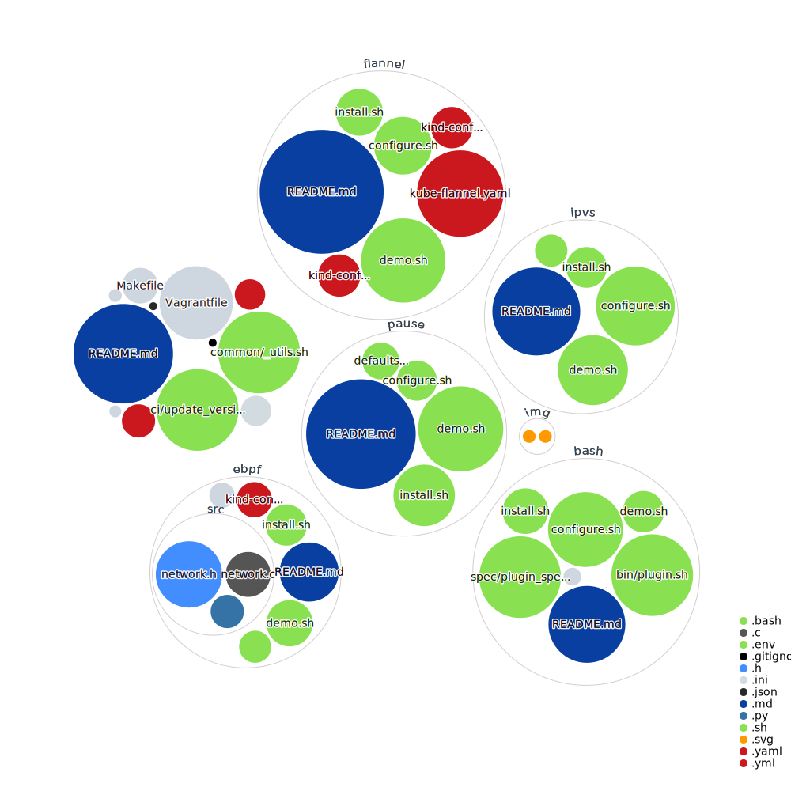

# Kubernetes Networking deep dive Demo
<!-- markdown-link-check-disable-next-line -->

<!-- markdown-link-check-disable-next-line -->

## Summary

This project collects instructions to discover, analyze and learn how
Kubernetes connects containers in different setups.

### Presentations

- Cloud-Native MX ([slides](https://www.slideshare.net/VictorMorales34/pod-sandbox-workflow-creation-from-dockershim)|[video](https://youtu.be/Gi_IBnyiAgw?t=2613))
- Comunidad DevOps + Cloud Native Costarica ([slides](https://www.slideshare.net/VictorMorales34/deep-dive-networking))
- Kubernetes Community Days GT 2021 ([slides](https://www.slideshare.net/VictorMorales34/understanding-kube-proxy-in-ipvs-mode)|[video](https://youtu.be/fT94W7kvdx4))
- OpenInfra Days Mexico 2022 ([slides](https://www.slideshare.net/VictorMorales34/deciphering-kubernetes-networking)|[video](https://www.youtube.com/watch?v=OuuM0H_5_sI))

## Virtual Machines

The [Vagrant tool][1] is used for provisioning Ubuntu Focal Virtual
Machines. It's highly recommended to use the  *setup.sh* script
of the [bootstrap-vagrant project][2] for installing Vagrant
dependencies and plugins required for this project. That script
supports two Virtualization providers (Libvirt and VirtualBox) which
are determine by the **PROVIDER** environment variable.

    curl -fsSL http://bit.ly/initVagrant | PROVIDER=libvirt bash

Once Vagrant is installed, it's possible to provision a Virtual
Machine using the following instructions:

    vagrant up <pause|ipvs|flannel|bash|ebpf>

## Linux interfaces for virtual networking

Linux has rich virtual networking capabilities that are used as basis for
hosting Virtual Machines and containers, as well as cloud environments.

### Bonded interface

Bonding driver provides a method for aggregating multiple network interfaces
into a single logical "bonded" interface. The behavior of the bonded interface
depends on the mode; generally speaking, modes provide either hot standby or
load balancing services.

### VLAN

A VLAN, aka virtual LAN, separates broadcast domains by adding tags to network
packets. VLANs allow network administrators to group hosts under the same switch
or between different switches.

### VXLAN

VXLAN (Virtual eXtensible Local Area Network) is a tunneling protocol designed
to solve the problem of limited VLAN IDs (4,096) in IEEE 802.1q. It is described
by IETF RFC 7348.

### MACVLAN

With MACVLAN, you can create multiple interfaces with different Layer 2 (that
is, Ethernet MAC) addresses on top of a single one.

### IPVLAN

IPVLAN is similar to MACVLAN with the difference being that the endpoints have
the same MAC address.

### VETH

The VETH (virtual Ethernet) device is a local Ethernet tunnel. Devices are
created in pairs, packets transmitted on one device in the pair are immediately
received on the other device. When either device is down, the link state of the
pair is down. These 2 devices can be imagined as being connected by a network
cable; each veth-device of a pair can be attached to different virtual entities
as OpenVswitch bridges, LXC containers or Linux standard bridges.

### Dummy

A dummy interface is entirely virtual like, for example, the loopback interface.
The purpose of a dummy interface is to provide a device to route packets through
without actually transmitting them.

### TUN

Network TUNnel, simulates a network layer device and operates in layer 3
carrying IP packets.

### TAP

A virtual "tap" device is a single point to point device which can be used by a
program in user-space or a virtual machine to send Ethernet packets on layer 2
directly to the kernel or receive packets from it. A file descriptor (fd) is
read/written during such a transmission. KVM/qemu virtualization uses "tap"
devices to equip virtualized guest system with a virtual and configurable
ethernet interface - which then interacts with the fd. A tap device can on
the other side be attached to a virtual Linux bridge; the kernel handles the
packet transfer as if it occurred over a virtual bridge port.

### Bridge

A bridge behaves like a network switch. It forwards packets between interfaces
that are connected to it. It's usually used for forwarding packets on routers,
on gateways, or between VMs and network namespaces on a host. It also supports
STP, VLAN filter, and multicast snooping.

#### Aspects and properties

- A "tap" device attached to one Linux bridge cannot be attached to another
  Linux bridge.
- All attached devices are switched into the promiscuous mode.
- The bridge itself (not a tap device at a port!) can get an IP address and may
  work as a standard Ethernet device. The host can communicate via this address
  with other guests attached to the bridge.
- You may attach several physical Ethernet devices (without IP !) of the host to
  a bridge - each as a kind of "uplink" to other physical switches/hubs and
  connected systems. With the spanning tree protocol activated all physical
  systems attached to the network behind each physical interface may communicate
  with physical or virtual guests linked to the bridge by other physical
  interfaces or virtual ports.
- Properly configured the bridge transfers packets directly between two specific
  bridge ports related to the communication stream of 2 attached guests -
  without exposing the communication to other ports and other guests. The bridge
  may learn and update the relevant association of MAC addresses to bridge
  ports.
- The virtual bridge device itself - in its role as an Ethernet device - does
  not work in promiscuous mode. However, packets arriving through one of its
  ports for (yet) unknown addresses may be flooded to all ports.
- You cannot bridge a Linux bridge directly by or with another Linux bridge (no
  Linux bridge cascading). You can neither connect a Linux bride to another
  Linux bridge via a "tap" device.

## Contribution

This is an open project, several individuals contribute in different forms like
coding, documenting, testing, spreading the word at events within others.

[1]: https://www.vagrantup.com/
[2]: https://github.com/electrocucaracha/bootstrap-vagrant
