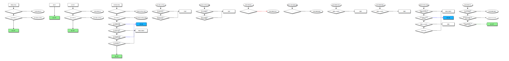
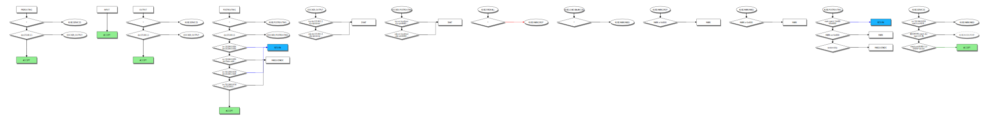

# Flannel CNI

Flannel is a simple and easy way to configure a layer 3 network fabric designed
for Kubernetes.

Flannel runs a small, single binary agent called flanneld on each host, and is
responsible for allocating a subnet lease to each host out of a larger,
preconfigured address space. Flannel uses either the Kubernetes API or etcd
directly to store the network configuration, the allocated subnets, and any
auxiliary data (such as the host's public IP). Packets are forwarded using one
of several backend mechanisms including VXLAN and various cloud integrations.

## NAT table rules

The following diagrams were created with [iptables-vis](https://github.com/Nudin/iptable_vis)
tool and pretend to clarify the rules created by Kubernetes components:

### Controller node



### Worker node



## Demo output example

The following output was capture from the _deploy.log_ file generated
from the `vagrant up` execution.

<!-- markdownlint-disable MD010 -->
```bash

15:38:51 - INFO: Cluster info:
name                podCIDR         InternalIP
k8s-control-plane   10.244.0.0/24   172.80.1.2
k8s-worker          10.244.2.0/24   172.80.1.3
k8s-worker2         10.244.1.0/24   172.80.1.4
name                                        podIP        nodeName
kube-flannel-ds-fg4x8                       172.80.1.4   k8s-worker2
kube-flannel-ds-r5kf5                       172.80.1.2   k8s-control-plane
kube-flannel-ds-sl7qs                       172.80.1.3   k8s-worker
coredns-6d4b75cb6d-dsfhk                    <none>       k8s-worker2
coredns-6d4b75cb6d-w8tks                    <none>       k8s-worker2
etcd-k8s-control-plane                      172.80.1.2   k8s-control-plane
kube-apiserver-k8s-control-plane            172.80.1.2   k8s-control-plane
kube-controller-manager-k8s-control-plane   172.80.1.2   k8s-control-plane
kube-proxy-c2grx                            172.80.1.4   k8s-worker2
kube-proxy-vpwb8                            172.80.1.2   k8s-control-plane
kube-proxy-z52wt                            172.80.1.3   k8s-worker
kube-scheduler-k8s-control-plane            172.80.1.2   k8s-control-plane
local-path-provisioner-6b84c5c67f-jlhx9     <none>       k8s-worker2
=== k8s-worker2 Worker node info ===

15:38:51 - INFO: Flannel dynamic configuration
FLANNEL_NETWORK=10.244.0.0/16
FLANNEL_SUBNET=10.244.1.1/24
FLANNEL_MTU=1450
FLANNEL_IPMASQ=true

15:38:51 - INFO: Network IPv4 addresses
1: lo: <LOOPBACK,UP,LOWER_UP> mtu 65536 qdisc noqueue state UNKNOWN group default qlen 1000
    inet 127.0.0.1/8 scope host lo
       valid_lft forever preferred_lft forever
2: kube-ipvs0: <BROADCAST,NOARP> mtu 1500 qdisc noop state DOWN group default 
    inet 10.96.0.10/32 scope global kube-ipvs0
       valid_lft forever preferred_lft forever
    inet 10.96.0.1/32 scope global kube-ipvs0
       valid_lft forever preferred_lft forever
3: flannel.1: <BROADCAST,MULTICAST,UP,LOWER_UP> mtu 1450 qdisc noqueue state UNKNOWN group default 
    inet 10.244.1.0/32 scope global flannel.1
       valid_lft forever preferred_lft forever
4: cni0: <BROADCAST,MULTICAST,UP,LOWER_UP> mtu 1450 qdisc noqueue state UP group default qlen 1000
    inet 10.244.1.1/24 brd 10.244.1.255 scope global cni0
       valid_lft forever preferred_lft forever
12: eth0@if13: <BROADCAST,MULTICAST,UP,LOWER_UP> mtu 1500 qdisc noqueue state UP group default  link-netnsid 0
    inet 172.80.1.4/24 brd 172.80.1.255 scope global eth0
       valid_lft forever preferred_lft forever

15:38:51 - INFO: VXLAN network devices
3: flannel.1: <BROADCAST,MULTICAST,UP,LOWER_UP> mtu 1450 qdisc noqueue state UNKNOWN mode DEFAULT group default 
    link/ether 1e:b2:62:1f:22:a4 brd ff:ff:ff:ff:ff:ff promiscuity 0 minmtu 68 maxmtu 65535 
    vxlan id 1 local 172.80.1.4 dev eth0 srcport 0 0 dstport 8472 nolearning ttl auto ageing 300 udpcsum noudp6zerocsumtx noudp6zerocsumrx addrgenmode eui64 numtxqueues 1 numrxqueues 1 gso_max_size 65536 gso_max_segs 65535 

15:38:51 - INFO: Network routes
default via 172.80.1.1 dev eth0 
10.244.0.0/24 via 10.244.0.0 dev flannel.1 onlink 
10.244.1.0/24 dev cni0 proto kernel scope link src 10.244.1.1 
10.244.2.0/24 via 10.244.2.0 dev flannel.1 onlink 
172.80.1.0/24 dev eth0 proto kernel scope link src 172.80.1.4 

15:38:51 - INFO: ARP cache entries
172.80.1.2 dev eth0 lladdr 02:42:ac:50:01:02 REACHABLE
10.244.2.0 dev flannel.1 lladdr 02:fe:eb:2b:de:63 PERMANENT
10.244.0.0 dev flannel.1 lladdr 9e:f7:72:ed:7e:5e PERMANENT
172.80.1.1 dev eth0 lladdr 02:42:55:a3:9c:de REACHABLE
=== k8s-worker Worker node info ===

15:38:52 - INFO: Flannel dynamic configuration
FLANNEL_NETWORK=10.244.0.0/16
FLANNEL_SUBNET=10.244.2.1/24
FLANNEL_MTU=1450
FLANNEL_IPMASQ=true

15:38:52 - INFO: Network IPv4 addresses
1: lo: <LOOPBACK,UP,LOWER_UP> mtu 65536 qdisc noqueue state UNKNOWN group default qlen 1000
    inet 127.0.0.1/8 scope host lo
       valid_lft forever preferred_lft forever
2: kube-ipvs0: <BROADCAST,NOARP> mtu 1500 qdisc noop state DOWN group default 
    inet 10.96.0.1/32 scope global kube-ipvs0
       valid_lft forever preferred_lft forever
    inet 10.96.0.10/32 scope global kube-ipvs0
       valid_lft forever preferred_lft forever
3: flannel.1: <BROADCAST,MULTICAST,UP,LOWER_UP> mtu 1450 qdisc noqueue state UNKNOWN group default 
    inet 10.244.2.0/32 scope global flannel.1
       valid_lft forever preferred_lft forever
10: eth0@if11: <BROADCAST,MULTICAST,UP,LOWER_UP> mtu 1500 qdisc noqueue state UP group default  link-netnsid 0
    inet 172.80.1.3/24 brd 172.80.1.255 scope global eth0
       valid_lft forever preferred_lft forever

15:38:52 - INFO: VXLAN network devices
3: flannel.1: <BROADCAST,MULTICAST,UP,LOWER_UP> mtu 1450 qdisc noqueue state UNKNOWN mode DEFAULT group default 
    link/ether 02:fe:eb:2b:de:63 brd ff:ff:ff:ff:ff:ff promiscuity 0 minmtu 68 maxmtu 65535 
    vxlan id 1 local 172.80.1.3 dev eth0 srcport 0 0 dstport 8472 nolearning ttl auto ageing 300 udpcsum noudp6zerocsumtx noudp6zerocsumrx addrgenmode eui64 numtxqueues 1 numrxqueues 1 gso_max_size 65536 gso_max_segs 65535 

15:38:52 - INFO: Network routes
default via 172.80.1.1 dev eth0 
10.244.0.0/24 via 10.244.0.0 dev flannel.1 onlink 
10.244.1.0/24 via 10.244.1.0 dev flannel.1 onlink 
172.80.1.0/24 dev eth0 proto kernel scope link src 172.80.1.3 

15:38:52 - INFO: ARP cache entries
10.244.0.0 dev flannel.1 lladdr 9e:f7:72:ed:7e:5e PERMANENT
172.80.1.1 dev eth0 lladdr 02:42:55:a3:9c:de REACHABLE
172.80.1.2 dev eth0 lladdr 02:42:ac:50:01:02 REACHABLE
10.244.1.0 dev flannel.1 lladdr 1e:b2:62:1f:22:a4 PERMANENT

15:38:52 - INFO: Pods creation

15:38:56 - INFO: Traffic verification
PING 10.244.1.5 (10.244.1.5): 56 data bytes
64 bytes from 10.244.1.5: seq=0 ttl=62 time=1.370 ms
15:38:57.425801 IP (tos 0x0, ttl 64, id 34912, offset 0, flags [DF], proto ICMP (1), length 84)
    10.244.2.2 > 10.244.1.5: ICMP echo request, id 1, seq 1, length 64
15:38:57.426128 IP (tos 0x0, ttl 62, id 33637, offset 0, flags [none], proto ICMP (1), length 84)
    10.244.1.5 > 10.244.2.2: ICMP echo reply, id 1, seq 1, length 64
Frame 1: 98 bytes on wire (784 bits), 98 bytes captured (784 bits) on interface vethdd08fce6, id 0
    Interface id: 0 (vethdd08fce6)
        Interface name: vethdd08fce6
    Encapsulation type: Ethernet (1)
    Arrival Time: Sep 22, 2022 15:38:59.426914983 UTC
    [Time shift for this packet: 0.000000000 seconds]
    Epoch Time: 1663861139.426914983 seconds
    [Time delta from previous captured frame: 0.000000000 seconds]
    [Time delta from previous displayed frame: 0.000000000 seconds]
    [Time since reference or first frame: 0.000000000 seconds]
    Frame Number: 1
    Frame Length: 98 bytes (784 bits)
    Capture Length: 98 bytes (784 bits)
    [Frame is marked: False]
    [Frame is ignored: False]
    [Protocols in frame: eth:ethertype:ip:icmp:data]
Ethernet II, Src: e2:44:ae:4f:52:97 (e2:44:ae:4f:52:97), Dst: 62:3c:88:eb:4a:37 (62:3c:88:eb:4a:37)
    Destination: 62:3c:88:eb:4a:37 (62:3c:88:eb:4a:37)
        Address: 62:3c:88:eb:4a:37 (62:3c:88:eb:4a:37)
        .... ..1. .... .... .... .... = LG bit: Locally administered address (this is NOT the factory default)
        .... ...0 .... .... .... .... = IG bit: Individual address (unicast)
    Source: e2:44:ae:4f:52:97 (e2:44:ae:4f:52:97)
        Address: e2:44:ae:4f:52:97 (e2:44:ae:4f:52:97)
        .... ..1. .... .... .... .... = LG bit: Locally administered address (this is NOT the factory default)
        .... ...0 .... .... .... .... = IG bit: Individual address (unicast)
    Type: IPv4 (0x0800)
Internet Protocol Version 4, Src: 10.244.2.2, Dst: 10.244.1.5
    0100 .... = Version: 4
    .... 0101 = Header Length: 20 bytes (5)
    Differentiated Services Field: 0x00 (DSCP: CS0, ECN: Not-ECT)
        0000 00.. = Differentiated Services Codepoint: Default (0)
        .... ..00 = Explicit Congestion Notification: Not ECN-Capable Transport (0)
    Total Length: 84
    Identification: 0x89e6 (35302)
    Flags: 0x40, Don't fragment
        0... .... = Reserved bit: Not set
        .1.. .... = Don't fragment: Set
        ..0. .... = More fragments: Not set
    ...0 0000 0000 0000 = Fragment Offset: 0
    Time to Live: 64
    Protocol: ICMP (1)
    Header Checksum: 0x97d4 [validation disabled]
    [Header checksum status: Unverified]
    Source Address: 10.244.2.2
    Destination Address: 10.244.1.5
Internet Control Message Protocol
    Type: 8 (Echo (ping) request)
    Code: 0
    Checksum: 0xb76c [correct]
    [Checksum Status: Good]
    Identifier (BE): 1 (0x0001)
    Identifier (LE): 256 (0x0100)
    Sequence Number (BE): 3 (0x0003)
    Sequence Number (LE): 768 (0x0300)
    Data (56 bytes)

0000  9a 7f a6 0f 00 00 00 00 00 00 00 00 00 00 00 00   ................
0010  00 00 00 00 00 00 00 00 00 00 00 00 00 00 00 00   ................
0020  00 00 00 00 00 00 00 00 00 00 00 00 00 00 00 00   ................
0030  00 00 00 00 00 00 00 00                           ........
        Data: 9a7fa60f0000000000000000000000000000000000000000000000000000000000000000…
        [Length: 56]

Frame 2: 98 bytes on wire (784 bits), 98 bytes captured (784 bits) on interface vethdd08fce6, id 0
    Interface id: 0 (vethdd08fce6)
        Interface name: vethdd08fce6
    Encapsulation type: Ethernet (1)
    Arrival Time: Sep 22, 2022 15:38:59.427207621 UTC
    [Time shift for this packet: 0.000000000 seconds]
    Epoch Time: 1663861139.427207621 seconds
    [Time delta from previous captured frame: 0.000292638 seconds]
    [Time delta from previous displayed frame: 0.000292638 seconds]
    [Time since reference or first frame: 0.000292638 seconds]
    Frame Number: 2
    Frame Length: 98 bytes (784 bits)
    Capture Length: 98 bytes (784 bits)
    [Frame is marked: False]
    [Frame is ignored: False]
    [Protocols in frame: eth:ethertype:ip:icmp:data]
Ethernet II, Src: 62:3c:88:eb:4a:37 (62:3c:88:eb:4a:37), Dst: e2:44:ae:4f:52:97 (e2:44:ae:4f:52:97)
    Destination: e2:44:ae:4f:52:97 (e2:44:ae:4f:52:97)
        Address: e2:44:ae:4f:52:97 (e2:44:ae:4f:52:97)
        .... ..1. .... .... .... .... = LG bit: Locally administered address (this is NOT the factory default)
        .... ...0 .... .... .... .... = IG bit: Individual address (unicast)
    Source: 62:3c:88:eb:4a:37 (62:3c:88:eb:4a:37)
        Address: 62:3c:88:eb:4a:37 (62:3c:88:eb:4a:37)
        .... ..1. .... .... .... .... = LG bit: Locally administered address (this is NOT the factory default)
        .... ...0 .... .... .... .... = IG bit: Individual address (unicast)
    Type: IPv4 (0x0800)
Internet Protocol Version 4, Src: 10.244.1.5, Dst: 10.244.2.2
    0100 .... = Version: 4
    .... 0101 = Header Length: 20 bytes (5)
    Differentiated Services Field: 0x00 (DSCP: CS0, ECN: Not-ECT)
        0000 00.. = Differentiated Services Codepoint: Default (0)
        .... ..00 = Explicit Congestion Notification: Not ECN-Capable Transport (0)
    Total Length: 84
    Identification: 0x83dd (33757)
    Flags: 0x00
        0... .... = Reserved bit: Not set
        .0.. .... = Don't fragment: Not set
        ..0. .... = More fragments: Not set
    ...0 0000 0000 0000 = Fragment Offset: 0
    Time to Live: 62
    Protocol: ICMP (1)
    Header Checksum: 0xdfdd [validation disabled]
    [Header checksum status: Unverified]
    Source Address: 10.244.1.5
    Destination Address: 10.244.2.2
Internet Control Message Protocol
    Type: 0 (Echo (ping) reply)
    Code: 0
    Checksum: 0xbf6c [correct]
    [Checksum Status: Good]
    Identifier (BE): 1 (0x0001)
    Identifier (LE): 256 (0x0100)
    Sequence Number (BE): 3 (0x0003)
    Sequence Number (LE): 768 (0x0300)
    [Request frame: 1]
    [Response time: 0.293 ms]
    Data (56 bytes)

0000  9a 7f a6 0f 00 00 00 00 00 00 00 00 00 00 00 00   ................
0010  00 00 00 00 00 00 00 00 00 00 00 00 00 00 00 00   ................
0020  00 00 00 00 00 00 00 00 00 00 00 00 00 00 00 00   ................
0030  00 00 00 00 00 00 00 00                           ........
        Data: 9a7fa60f0000000000000000000000000000000000000000000000000000000000000000…
        [Length: 56]


15:38:59 - INFO: Workers status after Pods creation
=== k8s-worker2 Worker node info ===

15:38:59 - INFO: Last reserved IP address allocated by host-local
10.244.1.5
15:38:59 - INFO: Virtual Ethernet network devices connected to cni0
5: veth74b5d452@if2: <BROADCAST,MULTICAST,UP,LOWER_UP> mtu 1450 qdisc noqueue master cni0 state UP mode DEFAULT group default 
    link/ether 2e:46:ff:79:64:cb brd ff:ff:ff:ff:ff:ff link-netns cni-eddc5e70-3521-0ca2-99c9-252ca9abff60
6: vethc199ed31@if2: <BROADCAST,MULTICAST,UP,LOWER_UP> mtu 1450 qdisc noqueue master cni0 state UP mode DEFAULT group default 
    link/ether 4e:3d:9b:9f:d9:0c brd ff:ff:ff:ff:ff:ff link-netns cni-79e4e3e6-edaf-427f-dc8d-5dfc59a3dffd
7: veth47a6c79d@if2: <BROADCAST,MULTICAST,UP,LOWER_UP> mtu 1450 qdisc noqueue master cni0 state UP mode DEFAULT group default 
    link/ether 26:b2:e1:68:6c:b4 brd ff:ff:ff:ff:ff:ff link-netns cni-fdafe4ec-0884-ed31-8cd8-a7106f16e0c2
8: vethe273b23c@if2: <BROADCAST,MULTICAST,UP,LOWER_UP> mtu 1450 qdisc noqueue master cni0 state UP mode DEFAULT group default 
    link/ether 1e:00:e0:b4:8f:0b brd ff:ff:ff:ff:ff:ff link-netns cni-5f78dbec-f4b8-764c-2e95-a211482f3299

15:38:59 - INFO: Bridge network devices
bridge name	bridge id		STP enabled	interfaces
cni0		8000.22c375f1abe6	no		veth47a6c79d
							veth74b5d452
							vethc199ed31
							vethe273b23c

15:38:59 - INFO: cni0 network routes
10.244.1.0/24 dev cni0 proto kernel scope link src 10.244.1.1 
=== k8s-worker Worker node info ===

15:38:59 - INFO: Last reserved IP address allocated by host-local
10.244.2.2
15:38:59 - INFO: Virtual Ethernet network devices connected to cni0
5: vethdd08fce6@if2: <BROADCAST,MULTICAST,UP,LOWER_UP> mtu 1450 qdisc noqueue master cni0 state UP mode DEFAULT group default 
    link/ether 1e:e6:0c:4d:09:29 brd ff:ff:ff:ff:ff:ff link-netns cni-dc4a24a4-beaf-a6db-3483-fa480effdd65

15:39:00 - INFO: Bridge network devices
bridge name	bridge id		STP enabled	interfaces
cni0		8000.623c88eb4a37	no		vethdd08fce6

15:39:00 - INFO: cni0 network routes
10.244.2.0/24 dev cni0 proto kernel scope link src 10.244.2.1 
=== k8s-worker Worker node info ===

15:39:00 - INFO: MAC addresses learned by cni0
port no	mac addr		is local?	ageing timer
  1	1e:e6:0c:4d:09:29	yes		   0.00
  1	1e:e6:0c:4d:09:29	yes		   0.00
  1	e2:44:ae:4f:52:97	no		   0.69

15:39:00 - INFO: ARP cache entries to pinghost pod
10.244.1.0 dev flannel.1 lladdr 1e:b2:62:1f:22:a4 PERMANENT

15:39:00 - INFO: Forwarding Database entries of flannel.1
1e:b2:62:1f:22:a4 dst 172.80.1.4 self permanent
9e:f7:72:ed:7e:5e dst 172.80.1.2 self permanent
=== k8s-worker2 Worker node info ===

15:39:00 - INFO: Network device details of flannel.1
3: flannel.1: <BROADCAST,MULTICAST,UP,LOWER_UP> mtu 1450 qdisc noqueue state UNKNOWN mode DEFAULT group default 
    link/ether 1e:b2:62:1f:22:a4 brd ff:ff:ff:ff:ff:ff promiscuity 0 minmtu 68 maxmtu 65535 
    vxlan id 1 local 172.80.1.4 dev eth0 srcport 0 0 dstport 8472 nolearning ttl auto ageing 300 udpcsum noudp6zerocsumtx noudp6zerocsumrx addrgenmode eui64 numtxqueues 1 numrxqueues 1 gso_max_size 65536 gso_max_segs 65535 

15:39:00 - INFO: Flannel's VTEP MAC address stored into Annotations
{"VNI":1,"VtepMAC":"1e:b2:62:1f:22:a4"}
15:39:00 - INFO: Flannel's Public IP address stored into Annotations
172.80.1.4
```
